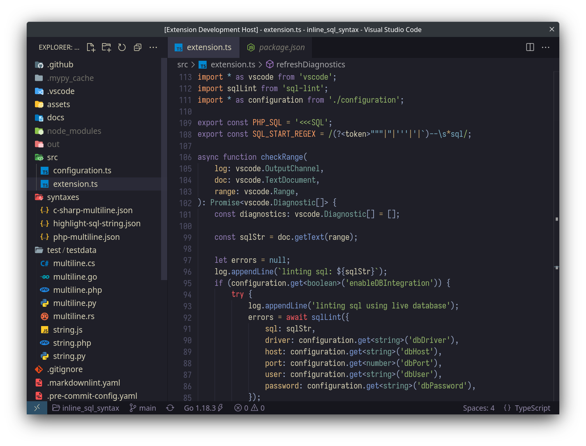

  <h2 align="center">🌊 KANAGAWA.vscode 🌊</h2>

  

VS Code port of amazing <a href="https://github.com/rebelot/kanagawa.nvim">KANAGAWA.nvim</a> theme by rebelot.
All credit for porting goes to <a href="https://github.com/conner-calhoun">conner-calhoun</a>.

<!-- 
 -->
<!--   <h2 align="center"></h2> -->
<!-- 
 -->
